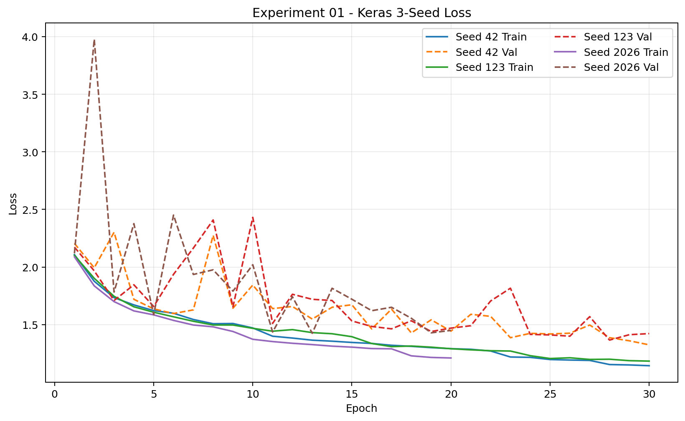
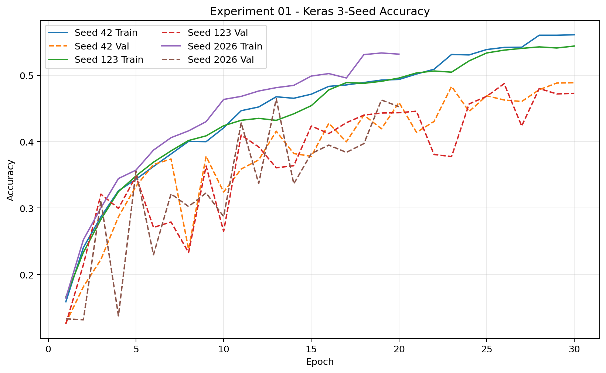
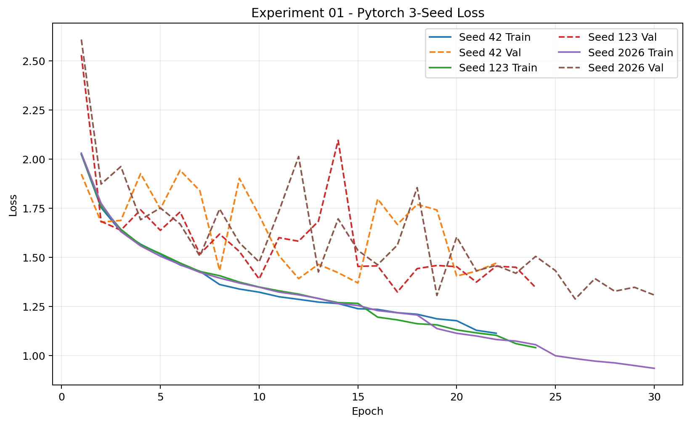
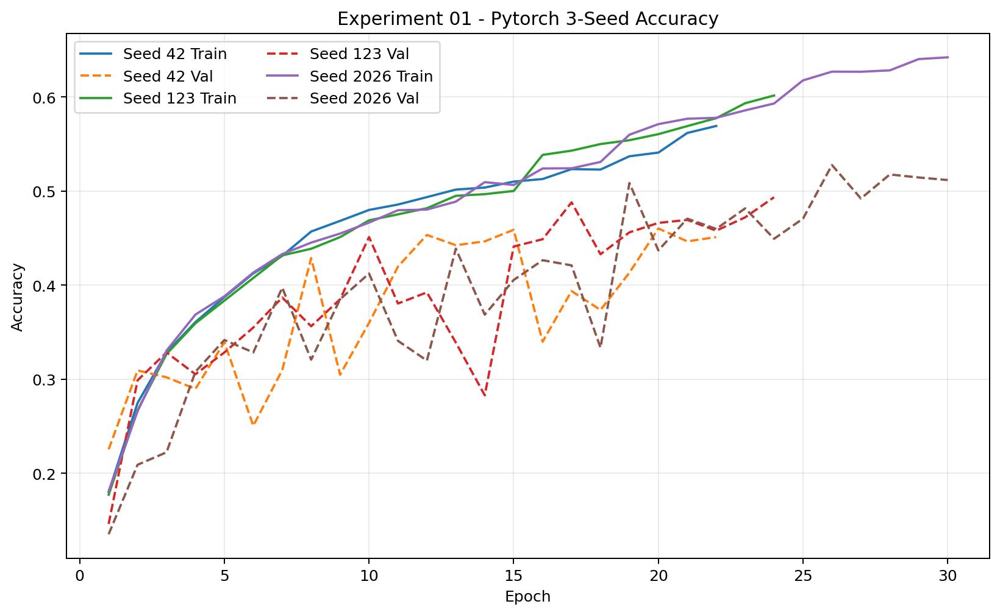
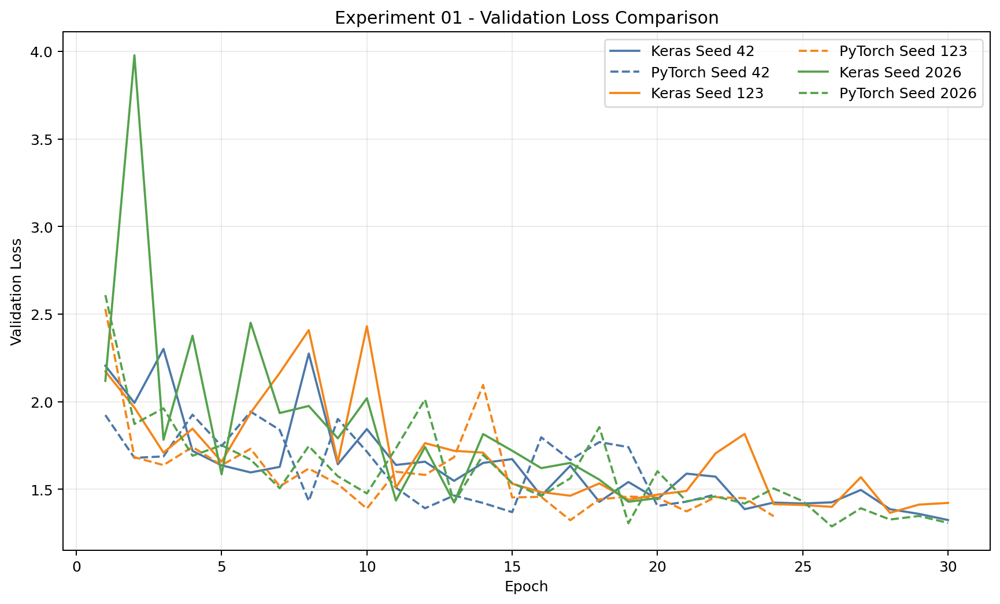
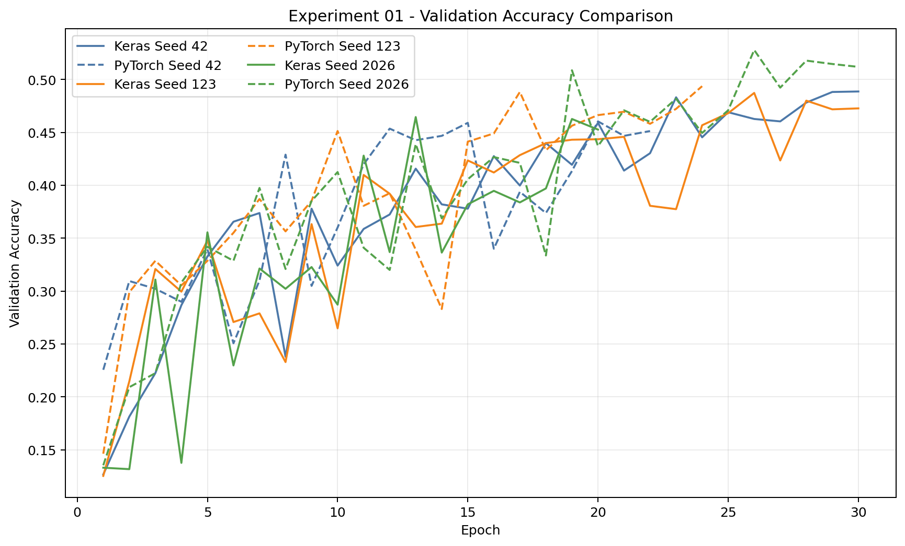

# Experiment 01 - Input Tensor Alignment

## 1. 목적

Keras와 PyTorch의 deterministic input preprocessing 차이가 Baseline 성능 Gap에 영향을 미치는지 검증한다. 이 실험은 누적 통제가 아니며, Final CNN Baseline으로 돌아가 **random augmentation 이전의 Input Tensor 처리만** 동일화한다.

## 2. Baseline

Experiment 00의 실제 3-Seed 결과를 고정 기준으로 사용하며 다시 학습하지 않는다.

| Metric | Keras | PyTorch | Signed Gap |
|---|---:|---:|---:|
| Test Accuracy | 47.19 ± 2.18% | 51.17 ± 0.11% | +3.98%p |
| Macro F1 | 45.84 ± 2.45% | 50.08 ± 0.23% | 약 +4.23%p |
| Test Loss | 1.3669 | 1.2733 | -0.0936 |

Signed Gap은 `PyTorch - Keras`로 정의한다. Absolute Gap은 그 절댓값이다. Primary metric은 Macro F1이며 Accuracy, Test Loss와 Seed 표준편차를 함께 본다.

## 3. Hypothesis

**H01-0:** Input Tensor 처리 차이는 Keras-PyTorch 성능 Gap의 주요 원인이 아니다. Input Tensor를 동일화해도 Baseline과 유사한 Framework Gap이 유지될 것이다.

**H01-1:** Input Tensor 처리 차이가 Framework Gap에 영향을 준다면 동일한 deterministic input preprocessing 사용 후 Baseline 대비 Accuracy Gap 또는 Macro F1 Gap이 감소할 것이다.

보조 분석으로 Baseline에서 크게 나타난 Keras의 3-Seed 표준편차가 Input Alignment 이후 감소하는지도 확인한다.

## 4. Changed Variable

변경 변수는 **Input Tensor deterministic preprocessing 하나뿐**이다.

- Image read: Pillow `Image.open`
- Color: `convert("RGB")`
- Resize: Pillow bilinear, 128×128
- Representation: NumPy HWC
- dtype: `float32`
- scale: `[0, 255] / 255.0` → `[0, 1]`
- Keras layout: NHWC
- PyTorch layout: NCHW로 단순 transpose

## 5. Unchanged Variables

다음은 각 Framework의 Baseline 구현을 유지하며 이번 실험에서 동일화하지 않는다.

- Batch Order
- Augmentation
- Initial Weight
- Output/Loss
- Adam
- BatchNorm
- EarlyStopping
- LR Scheduler
- Training Loop의 Framework별 방식

Keras는 `RandomFlip`과 `RandomRotation(0.014)`을 유지한다. PyTorch는 PIL 기반 `RandomHorizontalFlip(.5)`과 `RandomRotation(5°, bilinear)` 및 기존 RNG/fill 동작을 유지한다. Augmentation 자체의 decision, interpolation, fill 차이는 Experiment 03의 변수다.

## 6. Input Alignment Implementation

공통 함수 `common/input_alignment.py::load_aligned_rgb`에서 아래 경로를 한 번만 구현한다.

```text
JPG → Pillow decode → RGB → 128×128 Bilinear
→ NumPy float32 → /255.0 → HWC [0, 1]
```

Keras는 이 배열을 NHWC로 직접 입력한다. 기존 model 내부 `Rescaling(1/255)`은 제거해 double normalization을 방지하고, 그 뒤 Keras Baseline augmentation을 그대로 적용한다.

PyTorch는 공통 HWC 배열에 `permute(2, 0, 1)`만 적용한다. 학습 augmentation에서는 값이 정확한 `uint8/255` 격자이므로 PIL로 무손실 round-trip한 뒤 기존 PIL augmentation과 `ToTensor` 경로를 유지한다. 이 `ToTensor`는 PIL의 `[0,255]` 값을 한 번 `[0,1]`로 되돌리는 것이므로 double scaling이 아니다. Evaluation 입력에는 추가 scaling이 없다.

## 7. Numerical Sanity Check

Train split의 고정된 첫 8개 이미지를 사용하고 random augmentation을 끈 상태에서 비교했다. PyTorch NCHW를 NHWC로 transpose한 결과다.

| Check | Result |
|---|---:|
| Samples | 8 |
| Keras shape | `(8, 128, 128, 3)` |
| PyTorch shape | `(8, 3, 128, 128)` |
| dtype | `float32` |
| range | `[0.0, 1.0]` |
| MAE | `0.0` |
| Max Absolute Difference | `0.0` |
| MSE | `0.0` |
| `np.allclose(rtol=0, atol=1e-7)` | `True` |

상태: **Input Alignment Check PASS**.

단일 batch forward도 통과했다.

- Keras: TensorFlow Metal `GPU:0`, output `(32, 8)`, 423,784 parameters, finite
- PyTorch: MPS `mps:0`, output `(32, 8)`, 422,824 trainable parameters, finite

## 8. Seeds

```python
SEEDS = [42, 123, 2026]
```

각 Seed마다 framework seed를 다시 초기화하고 fresh model과 fresh optimizer를 생성한다. Keras는 model 생성 전에 `clear_session()`을 호출한다.

## 9. Metrics

- Primary: Macro F1
- Secondary: Test Accuracy, Test Loss
- Seed stability: Accuracy 표본 표준편차, Macro F1 표본 표준편차
- Paired Seed difference: `PyTorch - Keras`
- Gap Reduction: `Baseline Absolute Gap - Experiment 01 Absolute Gap`
- Gap Reduction Rate: `Gap Reduction / Baseline Absolute Gap`

Gap Reduction이 양수면 Gap 감소, 0에 가까우면 영향이 작음, 음수면 Gap 증가를 의미한다.

## 10. Training History

각 Seed가 학습을 끝내는 즉시 다음 공통 schema로 history CSV를 저장한다.

```text
framework, experiment, seed, epoch,
train_loss, train_accuracy, val_loss, val_accuracy,
learning_rate, elapsed_epoch_sec
```

저장 위치:

```text
results/history/keras_seed{seed}_history.csv
results/history/pytorch_seed{seed}_history.csv
```

`compare.py`는 6개 history가 모두 존재할 때 다음 Matplotlib 그래프를 생성한다.

- `results/figures/keras_3seed_loss.png`
- `results/figures/keras_3seed_accuracy.png`
- `results/figures/pytorch_3seed_loss.png`
- `results/figures/pytorch_3seed_accuracy.png`
- `results/figures/validation_loss_3seed_comparison.png`
- `results/figures/validation_accuracy_3seed_comparison.png`

EarlyStopping이 발생하면 실제로 학습된 epoch까지만 저장하고 그 길이만 그래프에 표시한다.

### 생성된 학습 곡선













## 11. Results

Keras와 PyTorch의 3-Seed 학습 및 Test 평가를 완료했다.

### Seed별 결과

| Seed | Framework | Test Accuracy | Macro F1 | Test Loss | Best Epoch | Epochs Trained |
|---:|---|---:|---:|---:|---:|---:|
| 42 | Keras | 49.43% | 47.91% | 1.3167 | 30 | 30 |
| 42 | PyTorch | 47.21% | 45.34% | 1.3642 | 15 | 22 |
| 123 | Keras | 48.39% | 46.79% | 1.3484 | 28 | 30 |
| 123 | PyTorch | 48.71% | 47.94% | 1.3156 | 17 | 24 |
| 2026 | Keras | 44.98% | 44.66% | 1.4196 | 13 | 20 |
| 2026 | PyTorch | 53.43% | 52.68% | 1.2581 | 26 | 30 |

### 3-Seed 평균

표준편차는 3개 Seed의 표본 표준편차(`ddof=1`)다.

| Metric | Keras mean ± std | PyTorch mean ± std | Signed Gap |
|---|---:|---:|---:|
| Test Accuracy | 47.60 ± 2.33% | **49.78 ± 3.25%** | +2.18%p |
| Macro F1 | 46.46 ± 1.65% | **48.66 ± 3.72%** | +2.20%p |
| Test Loss | 1.3615 ± 0.0527 | **1.3126 ± 0.0531** | -0.0489 |

Signed Gap은 `PyTorch - Keras`다. Seed 42에서는 Accuracy -2.22%p, Macro F1 -2.57%p로 Keras가 PyTorch를 역전했다. Seed 123의 Gap은 Accuracy +0.32%p, Macro F1 +1.15%p로 작았지만 Seed 2026에서는 각각 +8.44%p, +8.02%p로 크게 벌어졌다.

현재 상태: **3-Seed GPU 학습, Test 평가 및 비교 분석 완료**.

## 12. Comparison with Baseline

### Framework Gap 변화

| Metric | Baseline Gap | Experiment 01 Gap | Gap Reduction | Reduction Rate |
|---|---:|---:|---:|---:|
| Accuracy | 3.98%p | 2.18%p | **1.80%p** | **45.25%** |
| Macro F1 | 4.23%p | 2.20%p | **2.03%p** | **48.02%** |

### Framework별 평균 성능 변화

| Framework | Accuracy: 00 → 01 | 변화 | Macro F1: 00 → 01 | 변화 |
|---|---:|---:|---:|---:|
| Keras | 47.19% → 47.60% | +0.41%p | 45.84% → 46.46% | +0.61%p |
| PyTorch | 51.17% → 49.78% | -1.39%p | 50.08% → 48.66% | -1.42%p |

Gap 감소는 Keras 성능의 소폭 향상과 PyTorch 평균 성능 하락이 함께 만든 결과다. 따라서 Gap 감소만 보고 Keras 입력 처리의 개선 효과로 단순 해석하지 않는다.

### Seed 안정성 변화

| Framework | Metric | Baseline std | Experiment 01 std | 변화 |
|---|---|---:|---:|---:|
| Keras | Accuracy | 2.18%p | 2.33%p | +0.15%p |
| Keras | Macro F1 | 2.45%p | 1.65%p | -0.79%p |
| PyTorch | Accuracy | 0.11%p | 3.25%p | **+3.13%p** |
| PyTorch | Macro F1 | 0.23%p | 3.72%p | **+3.50%p** |

Keras Macro F1 변동성은 감소했지만 Accuracy 변동성은 거의 유지됐다. 반대로 Baseline에서 매우 안정적이었던 PyTorch는 Input Alignment 이후 Seed 민감도가 크게 증가했다.

상세 계산 결과는 [comparison_summary.json](results/comparison_summary.json)에 저장되어 있다. `compare.py`는 학습하거나 README를 자동 수정하지 않는다.

## 13. Interpretation

Experiment 01에서는 Keras와 PyTorch의 augmentation 이전 deterministic input preprocessing을 동일화하였다. 그 결과 평균 Macro F1 Gap은 Baseline의 4.23%p에서 2.20%p로 48.02% 감소했고, Accuracy Gap 역시 3.98%p에서 2.18%p로 45.25% 감소하였다.

그러나 Gap 감소는 Keras의 평균 성능 향상뿐 아니라 PyTorch 평균 성능 하락에도 영향을 받았다. Keras Macro F1은 +0.61%p 상승한 반면 PyTorch는 -1.42%p 하락했다. 또한 Baseline에서 매우 안정적이었던 PyTorch의 Seed 간 변동성이 크게 증가했고, Seed 42에서는 Keras가 PyTorch를 역전했다.

따라서 deterministic Input Tensor 처리 차이는 Framework Gap에 영향을 미치는 요인으로 판단된다. 다만 Seed별 효과의 방향과 크기가 일관되지 않고 Gap이 2.20%p 남았으므로 단독 원인으로 보기는 어렵다. H01-1은 **부분 지지**, H01-0은 **근거가 약화됐지만 완전히 배제할 수 없음**으로 평가한다.

## 14. Limitations

- deterministic preprocessing만 통제했으며 augmentation과 Batch Order 등은 Framework-specific 구현을 유지한다.
- 공통 float 입력을 PyTorch의 기존 PIL augmentation에 전달하기 위한 무손실 round-trip은 augmentation과 input representation의 경계에서 발생하는 구현상 제약이다.
- 3개 Seed와 하나의 고정 split만 사용하므로 통계적 일반화가 제한된다.
- TensorFlow Metal과 PyTorch MPS의 backend가 달라 학습시간은 주요 결론 근거로 사용하지 않는다.
- OFAT은 Input Tensor의 단독 효과를 선별하지만 다른 변수와의 interaction은 측정하지 않는다.

## 실행 방법

기본값은 두 파일 모두 `RUN_TRAINING = False`다. 실제 학습 시에만 각각 `True`로 변경한다.

```bash
.venv-metal/bin/python experiments/01_input_tensor_alignment/keras.py
.venv-metal/bin/python experiments/01_input_tensor_alignment/pytorch.py
.venv-metal/bin/python experiments/01_input_tensor_alignment/compare.py
```
