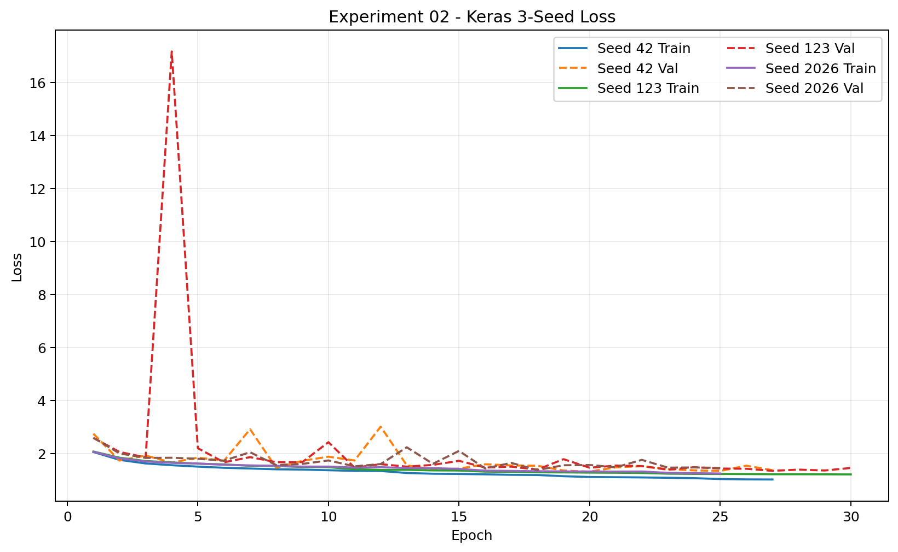
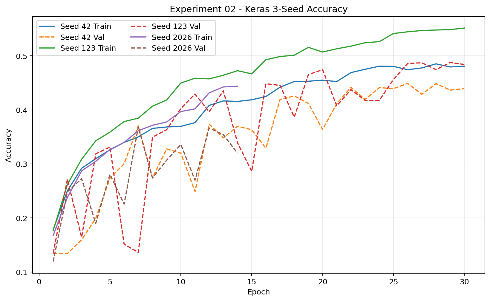
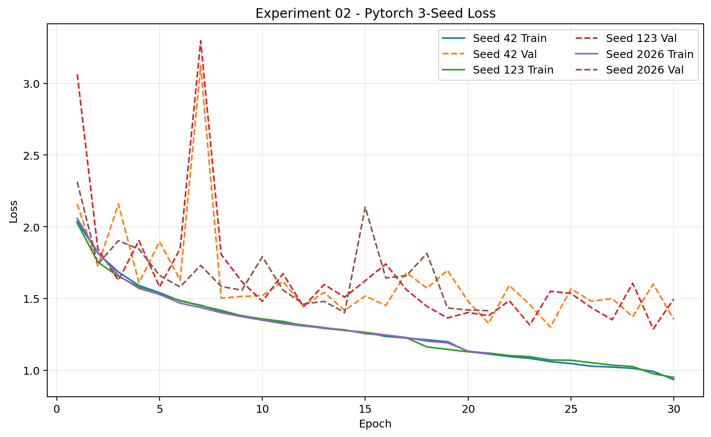
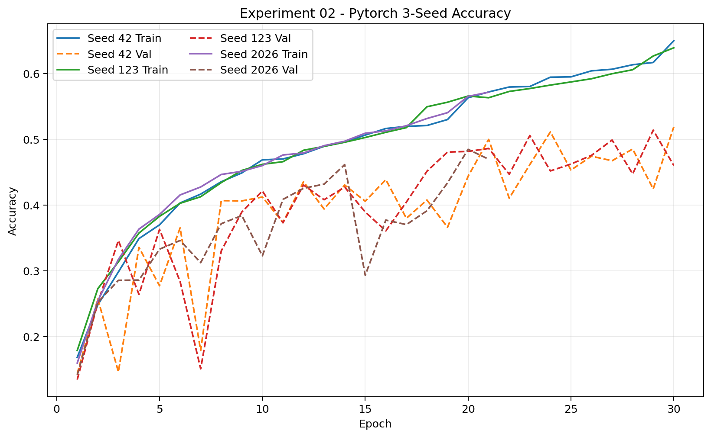
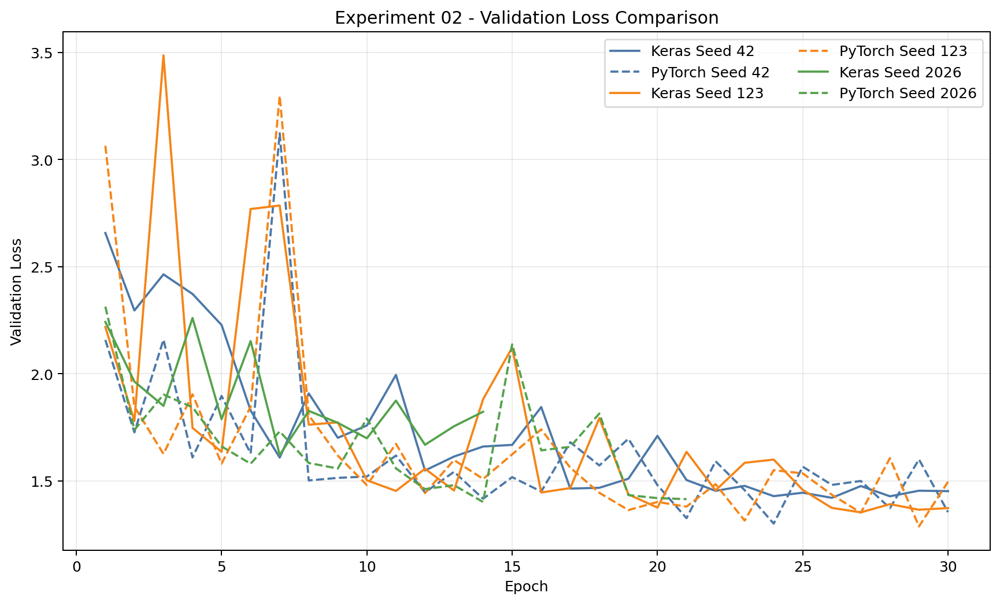
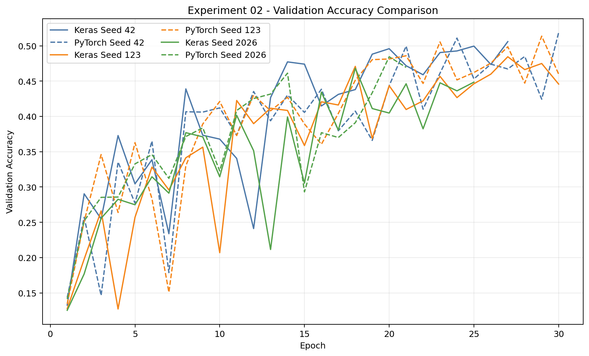

# Experiment 02 - Batch Order Alignment

## 1. 목적

Keras와 PyTorch에 동일한 epoch별 training sample permutation과 mini-batch grouping을 제공했을 때 Framework Gap과 Seed Stability가 어떻게 달라지는지 검증한다.

## 2. OFAT Design

Experiment 02는 **00 Final CNN Baseline + Training Batch Order only**인 독립 OFAT branch다. Experiment 01 Input Tensor Alignment를 누적하지 않았다. 비교 기준은 항상 Experiment 00이다.

Signed Gap은 `PyTorch - Keras`로 정의한다. 양수는 PyTorch, 음수는 Keras가 해당 지표에서 높다는 뜻이다.

| Baseline metric | Keras | PyTorch | Signed Mean Gap |
|---|---:|---:|---:|
| Accuracy | 47.19 ± 2.18% | 51.17 ± 0.11% | +3.98%p |
| Macro F1 | 45.84 ± 2.45% | 50.08 ± 0.23% | +4.23%p |
| Test Loss | 1.3669 ± 0.0404 | 1.2733 ± 0.0181 | -0.0936 |

환경은 Python 3.10.3, TensorFlow/Keras 2.18.1 + Metal, PyTorch 2.14.0 + MPS, Apple M1 Pro다. Seeds는 42, 123, 2026이다.

## 3. Attempt 1 - Invalid

**상태: INVALID / EXCLUDED**

첫 실행은 Keras 3 lifecycle 문제로 Keras epoch 1이 schedule index 1, PyTorch epoch 1이 schedule index 0을 사용했다. 실제 Batch Order가 일치하지 않았으므로 결과와 Gap 8.18%p는 공식 Experiment 02 결과에서 제외한다.

기존 CSV, history, figure, model과 조건 파일은 삭제하지 않고 [archive/invalid_run_01](archive/invalid_run_01/README.md)에 technical debugging record로 보존했다.

## 4. Bug Cause

Keras 3 `fit()`은 첫 training epoch 전에 data adapter를 reset하며, 이 과정에서 `Sequence.on_epoch_end()`를 호출한다. 기존 코드는 이 메서드에서 다음 permutation으로 이동했기 때문에 첫 epoch 전에 schedule이 한 칸 앞당겨졌다.

수정 사항:

- `on_epoch_end()`에서는 order를 변경하지 않는다.
- 실제 `on_epoch_begin()`에서 epoch N → schedule index N-1을 적용한다.
- Runtime 전체 order hash와 첫 3개 batch preview를 기록한다.
- `compare.py`는 runtime validation을 통과한 경우에만 성능 분석을 생성한다.

## 5. Attempt 2 - Runtime Validation

**상태: VALID / OFFICIAL RESULT**

`comparison_summary.json`과 `runtime_order_validation.json`에서 다음 조건이 모두 통과했다.

- `experiment_validity = VALID`
- `runtime_order_validation.status = VALID`
- `all_common_epoch_hashes_match = true`
- 각 Framework의 `self_schedule_match = true`
- Runtime trace epoch 수와 history epoch 수 일치

| Seed | Keras epochs | PyTorch epochs | Common epochs compared | Common hash exact match |
|---:|---:|---:|---:|---|
| 42 | 27 | 30 | 27 | `True` |
| 123 | 30 | 30 | 30 | `True` |
| 2026 | 25 | 21 | 21 | `True` |

사전 생성된 permutation만 같았던 것이 아니라, 실제 training runtime에서 양쪽이 공통으로 수행한 모든 epoch의 전체 sample-order SHA-256이 일치했다. EarlyStopping 후 한쪽에만 존재하는 epoch도 해당 Framework의 persisted schedule과 일치했다. 따라서 Attempt 2는 Batch Order Alignment OFAT 결과로 사용한다.

## 6. Changed Variable

변경 변수는 Training Batch Order뿐이다.

- Epoch별 training sample permutation
- 각 batch의 sample 구성
- Batch 내부 sample 순서
- 마지막 partial batch 처리

## 7. Unchanged Variables

- Framework별 Baseline input decoding, resize와 scaling
- Keras/PyTorch Baseline augmentation와 RNG semantics
- Framework별 default initial weight
- Keras Softmax/loss와 PyTorch logits/CrossEntropy
- Adam learning rate, beta, epsilon, weight decay, amsgrad
- Conv/BatchNorm/ReLU/MaxPool/GAP/Dense 구조와 BN 설정
- EarlyStopping, ReduceLROnPlateau와 Framework-specific timing
- Validation/Test pipeline, batch size 32

Experiment 01의 common input loader는 사용하지 않았다.

## 8. Batch Order Alignment Method

Train 10,251 samples를 `class_index → dataset-relative path`로 정렬해 canonical list를 만든다. 각 Seed의 `np.random.default_rng(seed)`로 최대 30 epoch permutation을 미리 만들고 Keras와 PyTorch가 같은 NPZ를 읽는다.

- Keras: 실제 `on_epoch_begin()`에서 persisted order 적용, `shuffle=False`
- PyTorch: epoch별 `FixedOrderSampler`, `shuffle=False`
- 양쪽 모두 batch size 32, 321 batches, 마지막 batch 11 samples
- Runtime CSV schema: `framework, seed, epoch, schedule_index, num_samples, order_hash`
- 첫 3개 batch는 sample index와 relative path만 preview CSV로 저장

## 9. Runtime Order Verification

Runtime gate는 다음을 순서대로 검증한다.

1. Epoch N이 schedule index N-1을 사용했는지 확인
2. Runtime hash가 persisted NPZ hash와 같은지 확인
3. 공통 epoch의 Keras/PyTorch hash가 같은지 확인
4. Runtime epoch 수와 history epoch 수가 같은지 확인

하나라도 실패하면 `Experiment Validity: INVALID`로 표시하고 성능 수치는 debugging reference로만 취급한다. Attempt 2는 모든 검증을 통과했다.

## 10. Hypotheses

- **H02-0:** Training Batch Order 차이는 Framework Gap의 주요 원인이 아니며, 동일화 후에도 Baseline과 비슷한 Gap이 유지된다.
- **H02-1:** Batch Order 차이가 Gap에 영향을 준다면 동일한 order와 grouping 사용 후 Baseline 대비 Accuracy 또는 Macro F1 Gap이 감소한다.
- 추가 관찰: Batch Order가 Seed Sensitivity에 영향을 준다면 Framework별 3-Seed 표준편차가 달라질 수 있다.

## 11. 3-Seed Results

| Seed | Keras Accuracy | PyTorch Accuracy | Accuracy Gap | Keras Macro F1 | PyTorch Macro F1 | Macro F1 Gap |
|---:|---:|---:|---:|---:|---:|---:|
| 42 | 50.70% | 50.02% | -0.68%p | 50.61% | 49.05% | -1.56%p |
| 123 | 47.07% | 51.66% | +4.58%p | 45.04% | 51.77% | +6.73%p |
| 2026 | 45.44% | 45.62% | +0.18%p | 44.54% | 43.32% | -1.22%p |

| Seed | Framework | Test Loss | Best Epoch | Epochs Trained |
|---:|---|---:|---:|---:|
| 42 | Keras | 1.3070 | 20 | 27 |
| 42 | PyTorch | 1.2809 | 24 | 30 |
| 123 | Keras | 1.3442 | 27 | 30 |
| 123 | PyTorch | 1.2718 | 29 | 30 |
| 2026 | Keras | 1.3755 | 18 | 25 |
| 2026 | PyTorch | 1.3893 | 14 | 21 |

Seed 42에서는 Accuracy와 Macro F1 모두 Keras가 높았다. Seed 123에서는 PyTorch가 높았고, Seed 2026은 Accuracy가 거의 같으며 Macro F1은 Keras가 1.22%p 높았다.

## 12. Mean ± Std

| Metric | Keras | PyTorch |
|---|---:|---:|
| Accuracy | 47.74 ± 2.70% | 49.10 ± 3.12% |
| Macro F1 | 46.73 ± 3.37% | 48.05 ± 4.31% |
| Test Loss | 1.3422 ± 0.0343 | 1.3140 ± 0.0653 |

## 13. Comparison with Baseline

| Metric | Baseline | Experiment 02 | Change |
|---|---:|---:|---:|
| Keras Accuracy | 47.19% | 47.74% | +0.54%p |
| Keras Macro F1 | 45.84% | 46.73% | +0.88%p |
| PyTorch Accuracy | 51.17% | 49.10% | -2.07%p |
| PyTorch Macro F1 | 50.08% | 48.05% | -2.03%p |
| Accuracy Signed Mean Gap | +3.98%p | +1.36%p | -2.62%p (65.78% 감소) |
| Macro F1 Signed Mean Gap | +4.23%p | +1.32%p | -2.91%p (68.87% 감소) |

Gap 감소에는 Keras의 소폭 향상과 PyTorch 평균 성능 하락이 함께 기여했다. Keras만 개선됐거나 PyTorch만 악화된 결과로 단순화할 수 없다.

## 14. Signed Gap vs Mean Absolute Paired Gap

Signed Mean Gap은 `mean(PyTorch - Keras)`로 평균적인 방향을 나타낸다. Mean Absolute Paired Gap은 `mean(abs(PyTorch - Keras))`로 Seed별 실제 차이의 평균 크기를 나타낸다.

| Metric | Gap definition | Baseline | Experiment 02 | Reduction |
|---|---|---:|---:|---:|
| Accuracy | Signed Mean | 3.98%p | 1.36%p | 65.78% |
| Accuracy | Mean Absolute Paired | 3.98%p | 1.82%p | 54.37% |
| Macro F1 | Signed Mean | 4.23%p | 1.32%p | 68.87% |
| Macro F1 | Mean Absolute Paired | 4.23%p | 3.17%p | 25.18% |

Seed별 우위 방향이 바뀌어 signed difference가 일부 상쇄된다. 따라서 “Framework 차이가 68.87% 사라졌다”라고 해석할 수 없다. 평균적인 PyTorch 방향의 편향은 크게 감소했지만, 개별 Seed의 절대적인 성능 차이는 완전히 제거되지 않았다.

## 15. Seed-Level Analysis

Baseline에서는 세 Seed 모두 PyTorch가 높았지만 Attempt 2의 Macro F1 방향은 Keras/PyTorch/Keras로 바뀌었다. 동일 Batch Order 사용 후 Baseline의 일관된 PyTorch 우위 방향이 사라진 것은 Batch Order 차이가 방향성에 영향을 주는 요인일 가능성을 시사한다.

Seed 123이 가장 큰 차이를 만들었다. Macro F1 Gap은 Seed 123에서 +6.73%p인 반면 Seed 42와 2026은 각각 -1.56%p, -1.22%p다. 따라서 평균 signed gap이 작더라도 두 Framework가 Seed별로 완전히 동일해졌다고 볼 수 없다.

독립 branch인 Experiment 01의 Macro F1 Signed Gap은 2.20%p, Mean Absolute Paired Gap은 3.91%p였고, Experiment 02는 각각 1.32%p와 3.17%p였다. 두 intervention 모두 Baseline 대비 감소 방향이지만 03~08 결과 전이므로 Batch Order가 가장 중요한 원인이라고 결론내리지 않는다.

## 16. Seed Stability

| Framework / Metric | Baseline std | Experiment 02 std | Change |
|---|---:|---:|---:|
| Keras Accuracy | 2.18%p | 2.70%p | +0.52%p |
| Keras Macro F1 | 2.45%p | 3.37%p | +0.92%p |
| PyTorch Accuracy | 0.11%p | 3.12%p | +3.01%p |
| PyTorch Macro F1 | 0.23%p | 4.31%p | +4.09%p |

Batch Order Alignment 후 Gap 감소가 관찰됐지만 Seed stability는 개선되지 않았다. 특히 PyTorch variation이 Baseline보다 크게 증가했다.

## 17. Training Dynamics

- 모든 Seed에서 train loss는 전반적으로 감소했지만 validation loss/accuracy는 크게 진동했다.
- Seed 42는 양쪽 모두 초반 validation instability가 강했다. Epoch 7 validation loss는 Keras 2.9163, PyTorch 3.1221이었고 best validation-loss epoch는 각각 20과 24였다.
- Keras Seed 123은 epoch 4 validation loss가 17.1640까지 일시적으로 상승한 뒤 회복했다.
- Seed 123 best epoch에서 Keras train/validation accuracy는 53.39%/48.45%, PyTorch는 62.64%/51.37%였다. PyTorch가 후반에 더 강하게 fitting했다.
- Seed 2026 best validation-loss epoch는 Keras 18, PyTorch 14였다. Test Accuracy는 0.18%p 차이였고 Macro F1은 Keras가 1.22%p 높았다.
- LR 변경 epoch는 Keras 42: 12/18/24, Keras 123: 10/15/22, Keras 2026: 15/22였다. PyTorch 42: 19/29, PyTorch 123: 17/28, PyTorch 2026: 19였다.

## 18. Figures

## 19. Hypothesis Evaluation

- **H02-0 — 지지 약화:** Signed Mean Gap과 Mean Absolute Paired Gap이 모두 Baseline보다 감소했다. 다만 Seed 3개만으로 통계적으로 기각했다고 표현하지 않는다.
- **H02-1 — 부분 지지:** Accuracy와 Macro F1에서 두 종류의 Gap이 모두 감소했다. 그러나 Seed 123에는 큰 Macro F1 Gap이 남았고 두 Framework의 Seed variance도 증가했으므로 Batch Order 하나가 전체 Gap을 설명한다고 볼 수 없다.

## 20. Interpretation

본 유효한 재실험에서 Batch Order를 동일화하자 Baseline의 일관된 PyTorch 우위 방향이 사라졌다. Signed Macro F1 Gap은 4.23→1.32%p로 감소했고 Mean Absolute Paired Macro F1 Gap도 4.23→3.17%p로 감소했다. 이는 Batch Order 차이가 Baseline Framework Gap에 영향을 주는 요인일 가능성을 시사한다.

그러나 Seed별 방향과 크기는 일관되지 않았고, 평균 Gap 감소에는 Keras의 소폭 향상과 PyTorch 평균 하락이 함께 작용했다. 특히 Seed 123의 차이와 증가한 Seed variance를 고려하면 Batch Order를 단독 원인으로 해석하기 어렵다.

## 21. Limitations

- Seed가 3개뿐이라 stochastic distribution과 통계적 유의성을 충분히 추정하지 못한다.
- 하나의 고정 split, dataset과 CNN architecture에 한정된다.
- OFAT은 Batch Order의 단독 intervention을 보지만 다른 변수와의 interaction은 직접 분리하지 못한다.
- Framework별 augmentation RNG, initialization, input processing, optimizer와 callback semantics는 다르다.
- TensorFlow Metal과 PyTorch MPS backend 차이가 유지된다.
- EarlyStopping으로 Framework별 실행 epoch 수가 달라 공통 구간만 cross-framework hash 비교 대상이다.

## 22. Conclusion

Batch Order를 동일화한 유효한 Attempt 2에서는 Baseline에서 세 Seed 모두 나타났던 일관된 PyTorch 우위 방향이 사라졌다. Signed Macro F1 Gap은 4.23%p에서 1.32%p로, Seed별 Mean Absolute Macro F1 Gap은 4.23%p에서 3.17%p로 감소했다.

따라서 본 실험은 Batch Order 차이가 Baseline Framework Gap에 영향을 주는 요인 중 하나일 가능성을 보여준다. 다만 Seed 123에서 여전히 큰 차이가 존재하고 두 Framework 모두 Seed variance가 증가했기 때문에 Batch Order만으로 전체 Framework Gap을 설명할 수는 없다.
