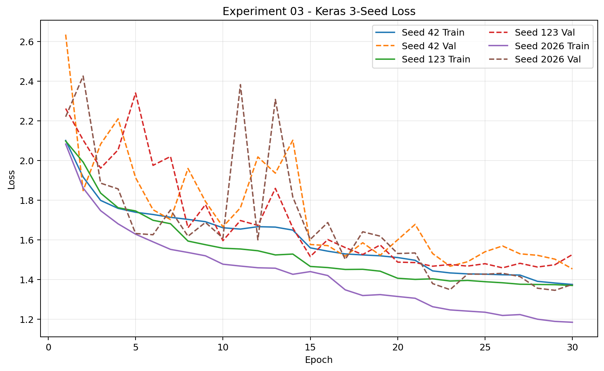
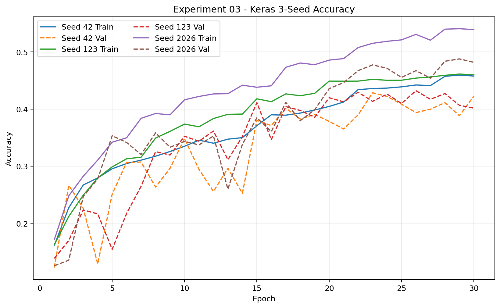
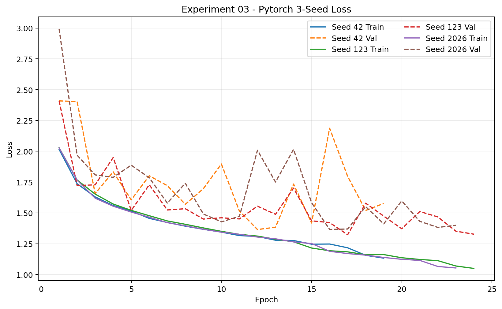
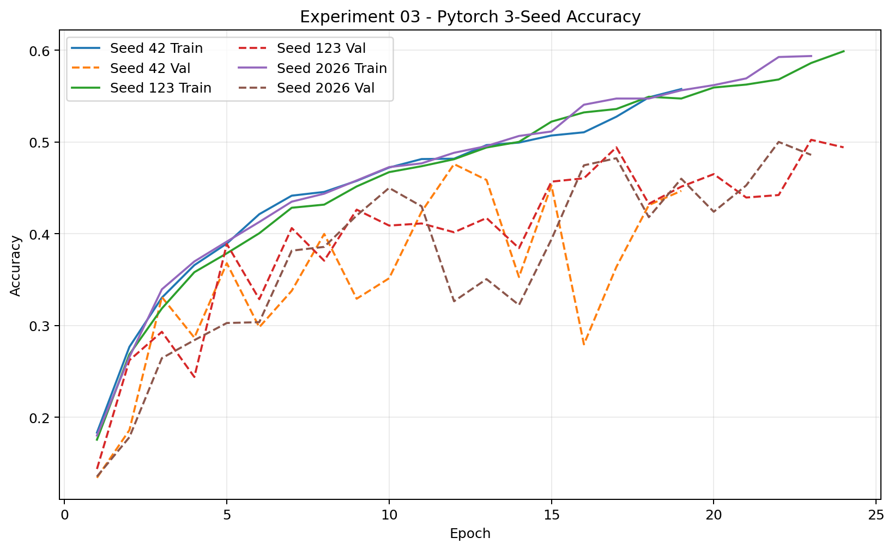
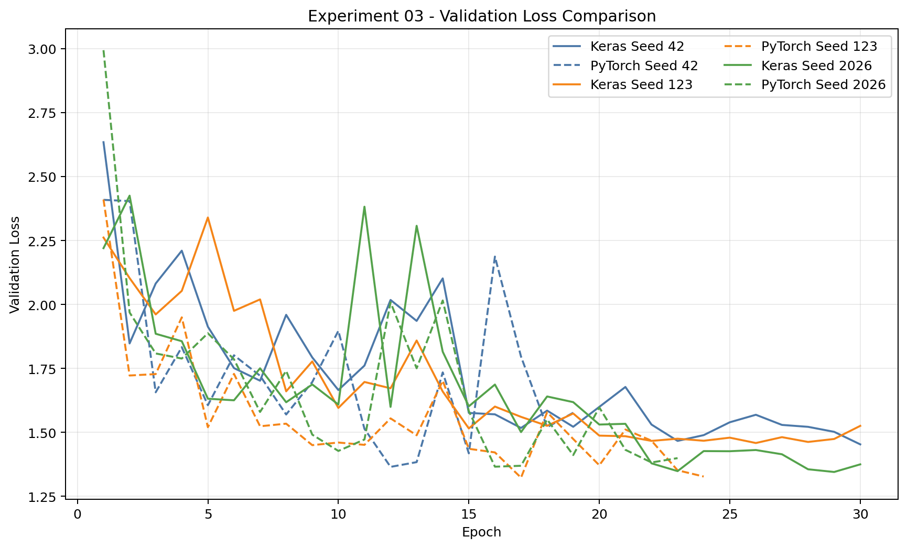
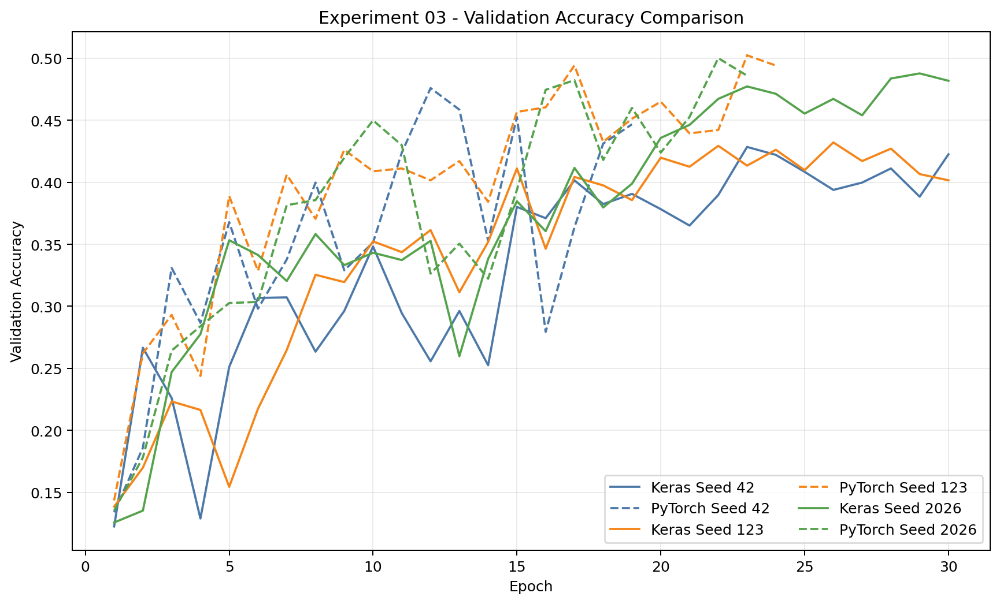

# Experiment 03 - Augmentation Alignment

## 1. Experiment Purpose

Keras와 PyTorch의 augmentation 조건을 정렬했을 때 Baseline Framework Gap과 Seed Stability가 어떻게 달라지는지 확인한다. 3-Seed 학습과 실제 runtime 검증이 완료됐으며, 이 문서의 공식 결과는 `VALID`인 실행만 사용한다.

## 2. Research Question

두 Framework에서 같은 이미지에 같은 epoch의 horizontal flip 여부와 rotation 각도를 적용하면 Accuracy·Macro F1 차이가 Baseline보다 줄어드는가? 이는 augmentation **조건 정렬**의 결과를 묻는 것이지 flip 또는 rotation 개별 효과를 측정하는 실험은 아니다.

## 3. OFAT Design

Experiment 03은 **Experiment 00 Baseline + Augmentation Alignment only**인 독립 branch다. Experiment 01의 common input preprocessing과 Experiment 02의 batch-order schedule을 누적하지 않는다. 기준은 항상 Experiment 00이다. Dataset split, 8 classes, CNN 구조, Seeds 42/123/2026, batch size 32, 최대 30 epochs는 유지한다.

## 4. Baseline Augmentation

Experiment 00의 실제 코드를 기준으로 확인한 차이다.

| Item | Keras Baseline | PyTorch Baseline |
|---|---|---|
| Flip | `RandomFlip("horizontal")`, p=0.5 | `RandomHorizontalFlip(0.5)` |
| Rotation | `RandomRotation(0.014)`, 약 ±5.04° | `RandomRotation(5)`, ±5° |
| Interpolation | bilinear | bilinear |
| Fill | reflect | constant 0 |
| Order | model Rescaling → Flip → Rotation | Resize → Flip → Rotation → ToTensor |
| RNG | Keras layer SeedGenerator | PyTorch transform RNG |
| Validation/Test | inference mode에서 augmentation 없음 | eval transform에 augmentation 없음 |

## 5. Changed Variable

Flip → rotation 순서, flip p=0.5, uniform rotation ±5°, bilinear interpolation, constant 0 fill과 `(seed, epoch, sample identity)`별 flip/angle parameter를 정렬했다. 동일 Seed 숫자만 지정한 것이 아니라 공통 결정 함수를 사용했다.

## 6. Unchanged Variables

- Keras의 TensorFlow decode/resize와 model `Rescaling(1/255)`, PyTorch의 PIL RGB/torchvision Resize/ToTensor를 각각 유지했다.
- Keras Sequence와 PyTorch DataLoader의 Baseline native shuffle을 유지했다. 공통 batch schedule은 사용하지 않았다.
- Framework별 초기 가중치 생성, Softmax/logits와 loss, Adam epsilon, BatchNorm semantics, EarlyStopping·LR scheduler timing은 유지했다.
- Validation/Test에 augmentation을 적용하지 않았다. 01·02·04–08 정렬 조건은 포함하지 않았다.

학습 전 Seed 42의 생성 직후 가중치를 00과 비교한 결과, 각 Framework 내부에서는 00과 03의 해당 배열이 exact match였다.

## 7. Augmentation Alignment Strategy

**Strict sample-ID mode**를 사용한다. Stable identity는 dataset root 기준 `train/<class>/<filename>`이며, SHA-256 기반 `(seed, zero-based epoch, identity)`에서 flip과 각도를 결정한다. 따라서 Framework별 batch order가 달라도 같은 sample과 epoch에는 같은 stochastic parameter가 대응한다. Metadata 경로만 이용하며 공통 PIL input loader로 training pipeline을 교체하지 않는다.

Keras는 실제 `on_epoch_begin()`에서 Epoch 1→schedule index 0, Epoch 30→index 29를 선택한다. Keras 3의 pre-fit `on_epoch_end()`로 생길 수 있는 offset을 피하도록 augmentation epoch는 그 메서드에서 전진시키지 않는다.

## 8. Strict Sample-ID Runtime Validation

**Experiment validity: `VALID` / official result.** [`comparison_summary.json`](results/comparison_summary.json)과 [`runtime_augmentation_validation.json`](results/runtime_augmentation_validation.json)의 `status=VALID`, `mode=strict_sample_id`, `all_common_epoch_hashes_match=true`를 확인했다. CSV/NPZ 실제 값을 validator로 다시 읽어 재계산해도 missing/errors가 없고 모든 자체 schedule match와 공통 epoch hash match가 참이다.

| Seed | Keras epochs | PyTorch epochs | Common epochs compared | Both self-match | Framework hash match |
|---:|---:|---:|---:|---|---|
| 42 | 30 | 19 | 19 | `true` | `true` |
| 123 | 30 | 24 | 24 | `true` | `true` |
| 2026 | 30 | 23 | 23 | `true` | `true` |

사전 augmentation schedule만 동일했던 것이 아니다. 실제 training `__getitem__()`에서 소비한 sample identity·flip·angle을 기록한 runtime artifact에서, 양쪽이 공통으로 수행한 모든 epoch의 parameter hash가 정확히 일치했다. 한쪽만 더 수행한 epoch는 각 Framework 자체 schedule과 대조했다. 따라서 본 실행을 Augmentation Alignment OFAT 결과로 사용한다.

## 9. Residual Framework Differences

이 `VALID` 판정은 같은 sample의 flip decision과 rotation angle **parameter**가 일치했다는 뜻이다. TensorFlow projective transform과 torchvision rotation의 좌표 convention, interpolation 구현, boundary handling 및 Baseline input preprocessing 차이 때문에 augmented pixels가 bitwise/pixel-exact하다는 뜻은 아니다.

학습 전 8개 공통 canonical image에서 operator를 비교한 diagnostic은 0–255 pixel scale 기준 평균 MAE 0.8035, 평균 MSE 16.2161, 최대 절대차 114.5291이었다. 이 diagnostic은 training input을 변경하지 않았으며 실제 학습 데이터에 대한 pixel-equivalence 증명으로 사용하지 않는다.

## 10. Hypotheses

- **H03-0:** Augmentation 구현·stochastic behavior 차이가 주요 요인이 아니라면 정렬 후에도 Baseline과 비슷한 Gap이 유지된다.
- **H03-1:** 차이가 Gap에 영향을 준다면 정렬 후 Baseline 대비 Accuracy 또는 Macro F1 Gap이 감소한다.
- 보조 관찰: Framework별 3-Seed 표준편차 변화.

## 11. 3-Seed Results

Gap은 `PyTorch − Keras`이며 양수는 PyTorch 지표가 높다는 뜻이다. 아래 수치는 현재 두 결과 CSV에서 계산했다.

| Seed | Keras Accuracy | PyTorch Accuracy | Accuracy Gap | Keras Macro F1 | PyTorch Macro F1 | Macro F1 Gap |
|---:|---:|---:|---:|---:|---:|---:|
| 42 | 43.99% | 45.89% | +1.91%p | 42.91% | 45.44% | +2.54%p |
| 123 | 42.71% | 46.80% | +4.09%p | 39.85% | 46.25% | +6.40%p |
| 2026 | 48.30% | 45.98% | -2.32%p | 46.70% | 44.68% | -2.02%p |

| Seed | Keras Test Loss | Keras Best / Trained | PyTorch Test Loss | PyTorch Best / Trained |
|---:|---:|---:|---:|---:|
| 42 | 1.4490 | 30 / 30 | 1.3650 | 12 / 19 |
| 123 | 1.4632 | 26 / 30 | 1.3362 | 17 / 24 |
| 2026 | 1.3448 | 29 / 30 | 1.3787 | 16 / 23 |

## 12. Mean ± Std

세 Seed의 sample standard deviation (`ddof=1`)이다.

| Metric | Keras | PyTorch |
|---|---:|---:|
| Accuracy | 45.00 ± 2.93% | 46.22 ± 0.50% |
| Macro F1 | 43.15 ± 3.43% | 45.46 ± 0.78% |
| Test Loss | 1.4190 ± 0.0647 | 1.3600 ± 0.0217 |

## 13. Comparison with Baseline

| Metric | Baseline Signed Mean Gap | Experiment 03 Signed Mean Gap | Reduction |
|---|---:|---:|---:|
| Accuracy | +3.98%p | +1.23%p | 2.75%p (69.20%) |
| Macro F1 | +4.23%p | +2.31%p | 1.93%p (45.52%) |

Baseline은 세 Seed 모두 PyTorch 방향이었다. Experiment 03은 Seed 2026에서 방향이 역전됐으므로 signed gap만으로 차이의 크기를 설명할 수 없다.

## 14. Signed Gap vs Mean Absolute Paired Gap

`Signed Mean Gap = mean(PyTorch − Keras)`는 평균 우위 방향, `Mean Absolute Paired Gap = mean(abs(PyTorch − Keras))`는 같은 Seed끼리 짝지은 실제 차이의 평균 크기다. Seed별 방향이 섞이면 전자는 상쇄된다.

| Metric | Definition | Baseline | Experiment 03 | Reduction |
|---|---|---:|---:|---:|
| Accuracy | Signed Mean | +3.98%p | +1.23%p | 69.20% |
| Accuracy | Mean Absolute Paired | 3.98%p | 2.77%p | 30.42% |
| Macro F1 | Signed Mean | +4.23%p | +2.31%p | 45.52% |
| Macro F1 | Mean Absolute Paired | 4.23%p | 3.65%p | 13.71% |

평균적인 PyTorch 방향의 F1 편향은 약 45.5% 감소했지만, Seed별 절대 F1 차이의 감소는 약 13.7%다. “Framework 차이가 45.5% 사라졌다”로 해석하지 않는다.

## 15. Framework Performance Change

| Metric | Keras Baseline → 03 | Change | PyTorch Baseline → 03 | Change |
|---|---:|---:|---:|---:|
| Accuracy | 47.19 → 45.00% | -2.19%p | 51.17 → 46.22% | -4.95%p |
| Macro F1 | 45.84 → 43.15% | -2.69%p | 50.08 → 45.46% | -4.62%p |
| Test Loss | 1.3669 → 1.4190 | +0.0521 | 1.2733 → 1.3600 | +0.0866 |

두 Framework 모두 Baseline보다 절대 성능이 낮았다. Gap 감소는 성능 향상을 뜻하지 않으며, PyTorch 평균 성능 하락 폭이 더 큰 점이 signed gap 감소에 기여했다.

## 16. Seed-Level Analysis

Baseline Macro F1의 3/3 Seed에서 나타난 PyTorch 우위는 여기서 2/3 Seed로 바뀌었다. Seed 42는 PyTorch +2.54%p, Seed 123은 +6.40%p, Seed 2026은 Keras +2.02%p다. 따라서 Baseline의 일관된 PyTorch 방향성은 유지되지 않았지만, 이를 augmentation 차이의 인과 증명으로 해석하지 않는다.

## 17. Seed Stability

| Framework / Metric | Baseline std | Experiment 03 std | Change |
|---|---:|---:|---:|
| Keras Accuracy | 2.18%p | 2.93%p | +0.75%p |
| Keras Macro F1 | 2.45%p | 3.43%p | +0.99%p |
| PyTorch Accuracy | 0.11%p | 0.50%p | +0.39%p |
| PyTorch Macro F1 | 0.23%p | 0.78%p | +0.56%p |

본 실험에서 Seed stability는 개선되지 않았다. PyTorch variation은 Baseline보다 커졌지만 Experiment 02의 F1 std 4.31%p보다는 작았다. Experiment 02는 독립 OFAT branch이므로 이 차이를 직접적인 누적 효과로 해석하지 않는다.

## 18. Training Dynamics

여섯 history CSV의 epoch 수는 결과 CSV 및 runtime trace와 일치한다. 양 Framework 모두 train loss가 전반적으로 감소했으나 validation loss/accuracy는 진동했다.

- Keras Seed 42/123/2026은 모두 30 epochs를 수행했고 best validation-loss epoch는 각각 30/26/29였다. Keras 123은 LR 감소 후에도 epoch 26까지, Keras 2026은 epoch 29까지 validation-loss 개선이 나타났다.
- PyTorch Seed 42/123/2026은 각각 19/24/23 epochs에서 EarlyStopping됐고 best epoch는 12/17/16이었다.
- Seed 42 PyTorch best epoch 12: train accuracy 48.17%, validation accuracy 47.58%, validation loss 1.3650. Keras는 epoch 30에서 최저 validation loss 1.4530을 기록했다.
- Seed 2026 Keras best epoch 29: train/validation accuracy 54.05%/48.77%, validation loss 1.3450. PyTorch best epoch 16: 54.05%/47.45%, validation loss 1.3657이며 epoch 23에 종료됐다.

## 19. EarlyStopping / LR Scheduler Observation

History에 기록된 LR 변경 epoch는 Keras Seed 42: 14/21/27, Seed 123: 7/14/19/30, Seed 2026: 16/21/27이다. PyTorch는 Seed 42: 17, Seed 123: 14/22, Seed 2026: 15/21이다. Framework별 best point와 종료 시점의 차이는 augmentation parameter를 맞춰도 optimization·validation dynamics가 동일하지 않음을 보여준다. Callback/Scheduler timing은 03에서 정렬하지 않았으며 Experiment 08의 후속 분석 대상이다.

## 20. Figures

실제 생성된 여섯 그림은 다음과 같다.

## 21. Hypothesis Evaluation

- **H03-0 — 지지 약화:** Accuracy와 Macro F1에서 signed 및 mean absolute paired Gap이 모두 Baseline보다 감소했다. Seed 3개만으로 통계적으로 기각했다고 표현하지 않는다.
- **H03-1 — 부분 지지:** 두 Gap 정의 모두 감소 방향이었다. 그러나 F1 paired absolute 감소는 13.71%에 그쳤고, Seed 123에는 +6.40%p 차이가 남았으며 양쪽 절대 성능 저하와 Seed variance 증가가 동반됐다.

## 22. Interpretation

Strict sample-ID 방식의 유효한 실행에서 augmentation stochastic parameters를 맞추자 Baseline 대비 Framework Gap 감소가 관찰됐다. 하지만 감소율은 signed F1 45.52%, mean absolute paired F1 13.71%로 상당히 다르다. Seed 방향이 섞인 결과에서 signed 평균만 강조하면 효과를 과장한다.

00–03의 독립 OFAT branch를 실제 CSV 기준으로 비교하면 다음과 같다.

| Experiment | Keras Macro F1 | PyTorch Macro F1 | Signed Mean F1 Gap | Mean Absolute Paired F1 Gap |
|---|---:|---:|---:|---:|
| 00 Baseline | 45.84% | 50.08% | +4.23%p | 4.23%p |
| 01 Input Tensor | 46.46% | 48.66% | +2.20%p | 3.91%p |
| 02 Batch Order (VALID Attempt 2) | 46.73% | 48.05% | +1.32%p | 3.17%p |
| 03 Augmentation | 43.15% | 45.46% | +2.31%p | 3.65%p |

현재까지는 02가 가장 큰 Seed-level absolute Macro F1 Gap 감소를 보였지만 04–08 결과가 남아 있으므로 주요 원인으로 확정하지 않는다. 03은 Gap 감소 방향이나 F1 paired absolute 감소가 제한적이며, 두 Framework 모두 절대 성능이 낮아진 점을 함께 본다.

## 23. Horizontal Flip / Rotation Interpretation Limit

본 실험은 Horizontal Flip 자체의 task suitability를 검증하지 않았다. Horizontal Flip과 Rotation을 포함한 Baseline augmentation policy를 유지하되 양쪽 stochastic 조건을 함께 정렬했다. 따라서 flip 또는 rotation 어느 한 요소가 성능 하락을 유발했다고 판단할 수 없다. 이를 검증하려면 no augmentation, rotation only, flip only, flip + rotation의 별도 policy ablation이 필요하다.

## 24. Limitations

- Parameter schedule exact match는 augmented pixels의 bitwise exact match를 뜻하지 않는다. Framework별 rotation numerical implementation 차이가 남는다.
- 기존 Framework별 deterministic input preprocessing, batch order, initialization, loss, optimizer, BN과 callback 차이가 유지된다.
- Seed 3개, 고정 split 하나, dataset 하나와 CNN architecture 하나에 한정된다.
- OFAT은 Baseline + one factor를 비교하므로 augmentation × batch order, augmentation × initialization, augmentation × optimizer 같은 interaction을 직접 측정하지 않는다.
- 3-Seed exploratory 결과만으로 통계적 유의성이나 일반적인 Framework 우열을 결론낼 수 없다.

## 25. Conclusion

Experiment 03은 같은 Seed/Epoch/Sample Identity에 실제 사용된 flip·rotation parameter가 양 Framework의 모든 공통 runtime epoch에서 일치한 `VALID` 실험이다. Baseline 대비 Signed Macro F1 Gap은 4.23→2.31%p, Mean Absolute Paired Macro F1 Gap은 4.23→3.65%p로 감소했다. 다만 후자의 감소율은 13.71%이고 두 Framework 모두 평균 Accuracy·F1이 하락했으며 Seed 123에 +6.40%p Gap이 남았다. 따라서 augmentation stochastic behavior 차이는 영향 요인일 가능성을 시사하지만 전체 Gap의 단독 원인으로 볼 수 없다.
